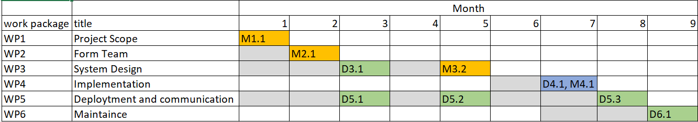

## MyWonder cloud-based computing platform  
# project summary
MyWonder is a cloud-based platform for data anslysis and visualizations. Traditionally, visualizing big data takes a long time and occupies a large portion of local storage. Our cloud-based platform moved the data storage to the cloud and carries most of the computation online, consequently enables a faster user experience during analysis.
# Three watses in this project  
Extra-storage: Storing unnecessary files on the cloud. Customer will sometimes forget what they have stored in the system and create subplicate files. These duplicated files take up huge space and reduce speed for other applications.  

Over-specification: Redundant terminology and functionalities in the user interface. "test visualization" and "test content" seems to be in the same functionality. Such redundency will cause confusion in user experience.  

Product defects: Cloud-based platform system failure and excessive internet overhead will affect the performance of our product.  

# Milestones  
* Have a design review with clients. This is a milestone because it maps to a key objective in the project. It's important for the team.  
* Create a production and test environment. This is a milestone because it's a tangible and important for the team to have different versions of working products so that a stable version can always be used for demonstration.  
* Draft a MyWdoner project statement. Properly state the project description and identify the issues we are solving for our potential clients. Layout the blue prints of out product, along with the advantages and risks. Locate the selling points and draft an elevator pitch. This is a milestone because it lays out the steps we need to follow and provide guidance the team's workflow.  

# Deliverables 
* Create a state of the art cloud-based online platforma for data visualization and analysis. This is a deliverable because it's a tangible product that meets the client's requirement.  
* Add a note taking functionality to the visualization. This is a deliverable because it's a tangible function requested by the clients. 
# Gantt Chart

